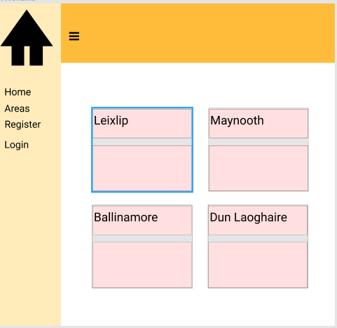
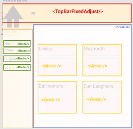

# Report for Mad.ie 📓

## Contents 🍩
1. User Stories
2. Wireframes
3. API End Points
4. Description
  - Create, Read Update and Delete 'Comments'
  - Authentication
  - One - Many DB structure
  - URL Parameters
  - Styling
  - Deployment
5. Reflection


### 🌈 User Stories

- As a first time buyer, I want to see what properties are available in my area so I can compare and get what's best for me.
- As a Real Estate Agent, I want to see what types of bids my properties are getting, so I can analyse the trends in the market.
- As a home owner, I want to be able to browse the properties available in my area, so I can see what is on the market.
- As a student not yet living away from home, I want to see how details about the properties, and more information so I know what I will or will not be able to afford.

### 🌈 Wireframes





### 🌈 API End Ponts

The following end points are defined and accessed by the user through the home.js page, which is what the user first sees. Using the React Router, along with Express URL Parameters, I routed the user to access different components of the application, depending on whether the user was logged in or not.
There are two one - many database relationships in this project, the first is areas - properties and the second is properties - comments.

The Authentication function checks to see if there is a JSON Web Token within the browser, and if there isn't it will redirect the user to enter their credentials. The handleLogin function ensures that the user doesn't have access to the Login component whilst logged in, or the Logged out component whilst logged out.

```js
<Route path="/" exact component={Home} />
<Route path="/register" component={Register} />
<Route path="/login" render={(props) => <Login {...props} handleLogin={this.login} />} />
<Route path="/logout" render={this.logout}/>
<Route exact path="/areas" component={Authentication(AreaList)}/>
<Route path="/areas/:name/properties/:id" component={Authentication(PropertyList)}/>
<Route path="/properties/:id/comments" component ={Authentication(CommentList)} />
<Route path="/edit-comment/:id" component={Authentication(EditComment)}/>
<Route path="/create-comment/:id" component={Authentication(CreateComment)}/>

```


### 🌈 Description

#### ⚡️ Create, Read Update and Delete 'Comments' ⚡️

Following an example on the IADT AdvancedJS GitHub example  with users, I was able to create a ``` <Comment/>``` component that allowed the user to create a bid on a property, edit and delete, and view the other bids associated with that property.

Connecting the application to a cloud Database using Mongo Atlas, I created collections within my MonogDB that contained sample information of comments.
These comments had key value pairs as follows :
```js
 { _id: ObjectID ("5ca88ce4ac6a9b0fcf641598")
  comment: "600,000"
  property_id: ObjectID ("5ca224a9e066e40322145fea")
}```

The Property ID was associated with each specific property in the property list, behaving as a foreign key in the comment component. It was accessed through Express URL Parameters, in the axios request that populates the comment list.
```
  axios.get(`api/properties/${this.props.match.params.id}/comments`)
  ```
#### ⚡️ Authentication ⚡️

Using an example also found on the IADT AdvancedJS website, I implemented a Register / Log in function using JSON web tokens, Bcrypt to hash the passwords stored in the Database to create a user interface in the application.

#### ⚡️ One - Many DB Structure  ⚡️

Using the same code structure, there were two one - many relationships developed in this project. The first one was Areas - Properties, and the second was Properties - Comments.

##### Areas - Properties
In this database relationship, one Area, such as Maynooth has many properties for sale. This means that the structure of the Properties object contains a foreign key called area_id which references which area has what properties for sale. In the server using Mongoose,
and Express URL Parameters the id of each area is accessed and only the properties with a matching area_id are returned in the properties component.

```js
  app.get('/api/areas/:id/properties', function(req, res) {
  Area.findOne({_id: req.params.id}, function(err, data) {
    if (err) throw err;

    Property.find({area_id: data._id}, function(err, properties) {
      if (err) throw err;

      res.send(properties);
```

##### Properties - Comments
Using the same idea as above, a property_id commment was injected into the JSON data for comment, acting as a foreign key and creating a one - many relationship with the help of Express' Parameters.


#### ⚡️ URL Parameters  ⚡️
Accessing information via the URL of a website was new territory, and took me a while to get the hang of. With reference to IDs and such it was relatively straight forward but using the name attribute in Area I was able to access the value through the URL in the propertylist component. This meant for the UI that I could show the user what area they were in, and what area the propertes were for sale in by saying
```
 All Properties in {this.props.match.params.name}
```
#### ⚡️ Styling  ⚡️

Using Material Designed Components for React, I styled the application accordingly. This is the most accessible styling system for React, designed by google it gives a very uniform and familiar interface to the user. However, when using Material, Sass is encouraged instead of CSS. This caused a few issues with my webpack.config file, something that I am not massively familiar with anyway.


#### ⚡️ Deployment ⚡️

Perhaps the biggest issue of this project was getting it deployed. Many things caused errors and bugs and jumping between each hosting site didn't help the process. I first tried to use Firebase, but it kept routing to the wrong files, giving me the same error that heroku did, which was "can't find public/src/server/index.html". I eventually figured out that the line of code in my index.js was causing all the fuss, ```app.use(express.static(path.join(__dirname, '/public'))); ``` as I didn't have the ```/```
before public.

However, webpack.config still has caused me errors, and when deploying to glitch (the environment became easier as I code edit and view the compiled code very quickly) still gives me errors about webpack not being installed, but I have it in my package.json, and my webpack.config file is identical to when it was working earlier on in the day.

I went back to my package.json after finishing the report and was able to fix the issues described above. The error seems to be in the order at which I called things in the package.json, but I will be looking into it more. 


### 🌈 Reflection
After finishing my main project which was a MERN application, I looked forward and wanted to enjoy this project as much as I could. I think that a lot of my time got used by trying to understand the webpack, and how it works which led me down many wormholes without actually figuring things out. Overall it was enjoyable to work with MongoDB and learn about Express, seeing how powerful passing data with URL Parameters can be. The styling was also enjoyable for me and thinking about the user more in this project was a great learning curve.


### 🌈 References
https://reactjs.org/docs/forms.html

https://expressjs.com/en/guide/routing.html

https://docs.mongodb.com/manual/

https://github.com/material-components/material-components-web-react

https://www.youtube.com/watch?v=1Y-PqBH-htk&fbclid=IwAR0VZ9NmH6ext1sB0vllICP7zcnf5XPJJwha3FDFNWpmyemadh0tZNJNypk&app=desktop

https://developer.mozilla.org/en-US/

https://reactjs.org/docs/react-without-es6.html#declaring-default-props

http://www.agilemodeling.com/artifacts/userStory.htm
